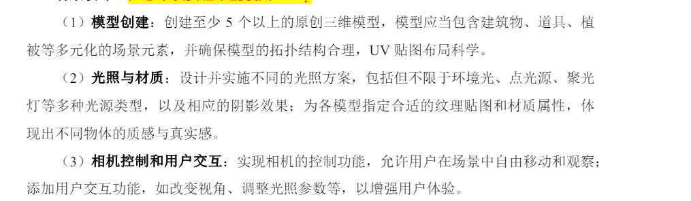

# openGL
> 目前的运行效果是官网的模型效果，可以通过鼠标滚轮调整视角，通过`WASD`移动视角，通过`ESC`退出程序
## 配置
- 系统：win11
- 编译器：mingw64
- IDE：Clion

## 已配置完成的库
- assimp 模型导入工作
- glad 用于加载OpenGL函数指针
- glfw 窗口管理
- glm 数学库
- stb_image 图片加载
- imgui 界面库
- imgui_impl_glfw_gl3 imgui的glfw3实现

## 开发进程
- [x] 基本库的导入
- [x] 构建基本的键盘鼠标控制模板
- [ ] 基于imgui搭建参数监控面板 
- [ ] blender模型制作，实现一个基本的场景
- [ ] 导入obj模型，实现一个基本的场景加载
- [ ] 添加天空盒
- [ ] 实现一个简单的光照系统
- [ ] 实现一个简单的阴影系统

## 要求说明

