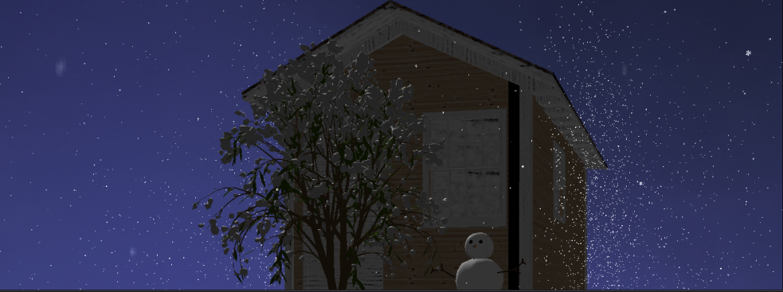
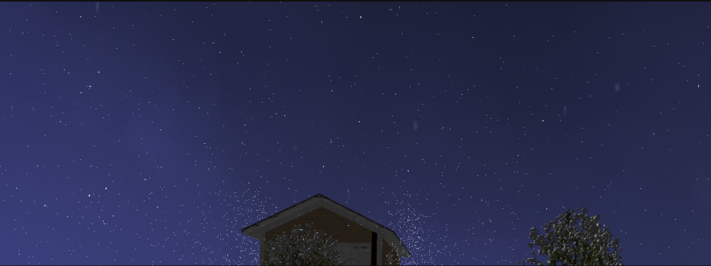

# Snow Cabin (雪中的小屋)

## 环境配置
- 系统：win11
- 编译器：mingw64
- IDE：Clion

## 项目结构
```
- include (相关头文件)
    - glad (glad库, 用于加载OpenGL函数指针)
    - imgui (imgui库, 用于创建UI界面)
    - stb_image (stb_image库, 用于加载纹理图片)
    - glm (glm库, 用于数学计算，包括矩阵，向量等)
    - assimp (assimp库, 用于导入模型)
    - glfw (glfw库, 用于窗口管理)
    - UI (imgui的相关实现，自定义的UI界面)
    ...
- lib (相关库文件)
    - glfw3.lib
    - libassimp.dll.a
    - libassimp-5.dll
    - libzlibstatic.a
    ...
- resources (资源文件)
    - models (模型文件)
    - shaders (着色器文件)
    - textures (纹理文件)
    ...
- Shaders (测试用着色器文件)
    - shader.vs (顶点着色器)
    - shader.fs (片段着色器)
- src (源代码)
    - glad.c (glad库的实现)
    - Particle.cpp (粒子系统)
- test (测试代码)
    - main.cpp (测试代码)
- main.cpp (程序入口)
```

## 已配置完成的库
- assimp 模型导入工作
- glad 用于加载OpenGL函数指针
- glfw 窗口管理
- glm 数学库
- stb_image 图片加载
- imgui 界面库

## 开发进程
- [x] 基本库的导入
- [x] 构建基本的键盘鼠标控制模板
- [x] 基于imgui搭建参数监控面板 
- [x] blender模型制作，实现一个基本的场景
- [x] 导入obj模型，实现一个基本的场景加载
- [x] 添加天空盒
- [x] 实现一个简单的光照系统
- [ ] 实现一个简单的阴影系统

## 运行方式
```
- git clone git@github.com:Tuziking/openGL.git
- 解压文件
- 使用clion打开文件目录，选择cmake-build-debug作为运行目录
- 运行main.cpp
```

## 项目展示
5.1 模型导入
编译文件，旋转视角可以看到3D模型已经被成功渲染，如下图。模型包含多种不同物品，用于模拟雪地中的场景。

图5-1-1 雪人模型

图5-1-2 树木模型

图5-1-3 椅子模型

图5-1-4 壁炉模型

图5-1-5 房屋模型
5.2 雪花粒子
通过设计粒子系统，同时设计粒子的总数与粒子出现的范围。下图展现了雪花的粒子效果，其中雪花粒子的加速度与飘动方向随机。

图5-2-1 雪花粒子

图5-2-2 雪花全景
5.3 光照效果
本项目包含了多种不同的光照，其中包含了点光源与直射光（太阳）。同时我们可以改变直射光的位置，实现

图5-3-1 手电筒光照

图5-3-2 直射光1

图5-3-3 直射光2

图5-3-4 直射光3

5.4 天空盒效果
下图呈现了天空盒的效果，随意转动视角不会出现割裂的感觉

图5-4-1 天空盒
5.5 ImGui操作
通过引入 ImGui 库实现了用户界面的快速构建和实时调试功能。下图展现了imgui的展示页面。其中右上角为渲染的图形，左下角区域为当前摄像机所处的位置，右侧上方为摄像机位置的滑动条，下方为直射光的滑动条，最下方为是否开启雪花粒子的选项。

图5-5-1 imgui界面

